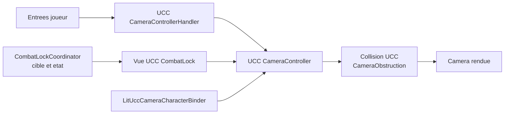

# Plan d'integration de la camera UCC et du lock de combat

## Statut et objectif

Ce document definit la refonte du lock de combat temps reel pour que la
camera UCC reste lisible et stable dans les espaces etroits. Il ne decrit pas
un nouveau rig : UCC reste le rig principal et le seul proprietaire du
`Transform` de la camera.

Objectif d'experience : verrouiller un ennemi ne doit jamais produire de saut
de position, de changement brutal d'orientation, ni d'alternance entre un mur
et un plan de jeu. La camera doit conserver le joueur et la cible lisibles,
en respectant les obstacles.

## Constat de la capture de reference

Capture analysee : `2026-07-27 21-08-24.mkv`, 19,62 secondes, 1920 x 1080,
60 images par seconde.

Les ruptures les plus nettes apparaissent vers :

- 8,69 a 8,89 s : plusieurs changements de cadrage tres rapproches ;
- 10,25 a 10,34 s : passage brutal d'un plan de couloir a un plan tres
  rapproche du mur ;
- apres 14,87 s : des changements de cadre similaires se reproduisent durant
  les actions et les deplacements.

Le phenomene est trop abrupt pour etre explique uniquement par un lissage
insuffisant. Il est coherent avec deux ecrivains qui corrigent alternativement
le `Transform` de la camera : le lock de combat ecrit directement son cadre,
alors que le `CameraController` UCC possede deja son propre suivi et sa propre
collision.

## Etat actuel a remplacer

`CombatLockOnCameraController` :

- calcule lui-meme position, rotation et FOV en `LateUpdate` ;
- realise un spherecast pour les obstacles ;
- desactive dynamiquement `CameraController`, `CameraControllerHandler` et
  `LitUccCameraCharacterBinder` ;
- retrouve ces composants par leur nom de type.

La camera configuree dans `GameplaySessionRoot` est une camera UCC avec la vue
`Adventure`. Son `CameraController` a deja un rayon de collision et gere le
binding du personnage via `LitUccCameraCharacterBinder`.

Cette coexistence est a supprimer. La recherche de composants par nom et leur
activation/desactivation ne doivent plus faire partie du fonctionnement du
lock.

## Architecture cible

Regles d'autorite :

| Systeme | Responsabilite | Interdit |
| --- | --- | --- |
| `CameraController` UCC | Transform, FOV, interpolation et collision | Etre desactive pendant un lock |
| `CameraControllerHandler` UCC | Entrees de camera | Etre active/desactive par le lock |
| `LitUccCameraCharacterBinder` | Attachement au personnage local | Repositionner la camera a chaque image |
| `CombatLockCoordinator` | Cible, entree/sortie de lock, donnees de cadrage | Ecrire le Transform, le FOV ou faire la collision |
| Vue UCC `CombatLock` | Cadrage et orientation de lock | Modifier l'etat de combat |

## Conception de la vue UCC CombatLock

1. Creer une vue UCC `CombatLock`, derivee de la vue third-person Adventure
   utilisee par le projet, ou une extension equivalente si la version UCC le
   demande.
2. La declarer explicitement dans le `CameraController` en plus de `Adventure`.
   Aucun remplacement de composant a l'execution n'est autorise.
3. Exposer dans l'inspecteur : offset d'epaule, hauteur, distance, FOV,
   biais joueur/cible, vitesse angulaire maximale, amortissement de position,
   amortissement de rotation et limites de pitch.
4. Fournir a cette vue un `CombatLockCameraContext` : joueur local, cible,
   `LockPoint`, validite de la cible et type de cadrage.
5. Calculer un point vise stable entre le buste du joueur et le `LockPoint` de
   l'ennemi. La cible doit influencer le cadre, sans pouvoir imposer un yaw
   instantane.
6. Filtrer la direction joueur-vers-cible dans le plan horizontal, limiter sa
   vitesse de rotation et conserver le dernier cap valide si les positions sont
   presque confondues.
7. Quand la cible est hors de vue ou derriere un mur, conserver la direction
   conservee un court instant ; ne pas retourner la camera vers le mur.

## Entree, sortie et changement de cible

### Entree en lock

1. `RealTimeCombatManager` valide la cible et publie un contexte immuable pour
   l'image en cours.
2. Le coordinateur memorise la vue UCC active, le FOV et le cap courant.
3. Il demande au `CameraController` de passer a `CombatLock`.
4. La vue initialise ses ressorts et ses filtres depuis l'etat courant de la
   camera UCC, jamais depuis un offset absolu.
5. La transition vers le nouveau cadre est interpolee. Un snap n'est admis que
   lors d'un chargement de scene ou d'un changement volontaire de personnage.

### Changement de cible

1. Conserver le meme mode de vue UCC.
2. Remplacer uniquement le contexte de cible apres validation.
3. Lisser le `LockPoint` et appliquer une hysteresis courte a la selection afin
   d'eviter une alternance entre ennemis voisins ou cibles momentanement
   masques.
4. Reinitialiser les vitesses de ressort seulement si l'ecart de cible est
   exceptionnellement grand ; le nouveau cadrage doit sinon partir de la pose
   courante.

### Sortie de lock

1. Conserver la camera UCC active.
2. Restaurer la vue qui etait active avant le lock et ses parametres UCC.
3. Interpoler hors du cadrage combat.
4. Liberer le contexte de lock seulement apres que la vue a recu la demande de
   sortie, afin d'eviter une image sans point de regard valide.

## Collision et visibilite

La collision doit etre resolue une seule fois par UCC, apres la determination
du cadrage combat. Le lock ne doit avoir ni spherecast ni calcul de distance
de secours a l'execution normale.

1. Creer et documenter une couche `CameraObstruction` pour les murs, piliers,
   plafonds et gros accessoires qui doivent rapprocher la camera.
2. Exclure de cette couche : joueur local, ennemis, hitboxes, ragdolls,
   projectiles, triggers, VFX et volumes d'interaction.
3. Configurer le masque UCC de collision pour ne considerer que le decor
   pertinent, avec `QueryTriggerInteraction.Ignore`.
4. Conserver le rayon UCC dans une plage testee en couloir et ne pas ajouter un
   second spherecast dans le lock.
5. Laisser le systeme XRay existant reveler les obstacles visuels compatibles.
   La compression de la distance doit rester l'exception ; la lisibilite du
   personnage doit etre maintenue par XRay lorsque possible.
6. Ajouter une hysteresis a la sortie de collision dans la vue ou le mecanisme
   UCC approprie : l'approche d'un mur doit etre immediate et la reprise de
   distance progressive.

## Binder, look source et ordre d'execution

1. `LitUccCameraCharacterBinder` reste actif durant le lock. Il ne doit appeler
   `PositionImmediately` qu'apres une vraie liaison de personnage, un
   changement de personnage ou une scene chargee.
2. Verifier que le `ILookSource` actif est celui de la camera UCC durant le
   lock. Le fallback `LitOpsiveLookSource` ne doit pas alterner avec lui.
3. Remplacer les recherches globales de composants par des references
   serializees ou un service de camera unique.
4. Definir l'ordre de mise a jour : simulation et cible de combat, contexte de
   lock, mise a jour UCC, rendu. Aucune ecriture de camera ne sera faite dans
   un `LateUpdate` concurrent.
5. Centraliser les appels `PositionImmediately` et les changements de vue dans
   une facade de camera avec traces de diagnostic en developpement.

## Instrumentation de diagnostic

Ajouter une instrumentation active seulement en developpement :

- nom de la vue UCC active et vue precedente ;
- cible, `LockPoint`, distance joueur-cible et validite du lock ;
- distance et collider retenus par la collision UCC ;
- nombre de changements de vue, de target et de repositionnements immediats ;
- avertissement lorsqu'un script autre que la facade UCC tente de modifier le
  Transform de la camera ;
- historique court horodate des transitions pour comparer les anomalies avec
  une capture video.

## Plan de mise en oeuvre

### Phase 0 — Baseline

1. Archiver la capture de reference et relever les instants 8,69–8,89 s,
   10,25–10,34 s et 14,87 s.
2. Ajouter les traces de diagnostic sans modifier le comportement.
3. Reproduire le probleme dans le couloir de la capture et sauvegarder une
   baseline de video et de logs.

### Phase 1 — Contrat d'autorite

1. Introduire la facade/service de camera UCC.
2. Faire passer `CombatLockOnCameraController` au role de coordinateur de
   contexte, sans ecriture directe de position, rotation ou FOV.
3. Supprimer la desactivation de composants UCC et la recherche par nom de
   type.
4. Verifier que l'ancien comportement n'introduit aucune ecriture camera hors
   UCC.

### Phase 2 — Vue CombatLock

1. Implementer et serialiser la vue UCC `CombatLock`.
2. Implementer l'entree, sortie et restauration de vue.
3. Brancher le contexte de combat et le filtrage de cible.
4. Verifier le cadrage en espace ouvert avant de tester les obstacles.

### Phase 3 — Collision et visibilite

1. Auditer les layers des murs et des elements dynamiques du couloir de test.
2. Appliquer le masque `CameraObstruction` a la collision UCC.
3. Ajuster rayon, offset et amortissement avec le profiler actif.
4. Verifier la coexistence avec XRay et les objets translucides.

### Phase 4 — Robustesse

1. Tester changement rapide de cible, cible morte, cible desactivee, perte de
   ligne de vue et sortie de portee.
2. Tester changement de personnage, chargement de scene, respawn et late join
   reseau.
3. Retirer ou desactiver les traces verbeuses apres validation, en conservant
   les compteurs utiles.

## Matrice de validation

| Scenario | Resultat attendu |
| --- | --- |
| Couloir de la capture avec lock | Aucun saut de position ou orientation ; camera stable contre le mur |
| Rotation rapide autour de l'ennemi | Yaw continu, vitesse plafonnee, pas de retournement |
| Ennemi pres d'un mur | Joueur et ennemi lisibles, collision UCC seule |
| Plusieurs obstacles successifs | Reprise de distance progressive, sans pompage |
| Changement de cible | Transition douce sans changement de vue parasite |
| Attaque, impact, esquive | Aucun `PositionImmediately` inattendu |
| Unlock | Retour continu vers Adventure, sans snap |
| Changement de personnage/scene | Un seul recentrage autorise et camera correctement liee |
| 30, 60 et 120 i/s | Meme comportement qualitatif et aucune oscillation dependante du framerate |

## Criteres d'acceptation

La livraison est validee si :

1. la camera UCC reste active pendant toute la duree du lock ;
2. aucun composant de combat n'ecrit directement le Transform ou le FOV de la
   camera ;
3. le scenario de la video ne presente plus de rupture image a image ;
4. les collisions rapprochent la camera sans changer son cap de maniere
   inattendue ;
5. le retour hors lock et le changement de cible sont continus ;
6. les tests de la matrice sont passes sur la scene de reference et une scene
   ouverte ;
7. le profiler ne montre ni allocation par image liee au lock, ni recherche
   globale de composants pendant le combat.

## Risques et parades

| Risque | Parade |
| --- | --- |
| API de vue UCC differente de celle attendue | Realiser un prototype isole de vue avant migration |
| Layers decor heterogenes | Audit scene par scene et outil de validation editor |
| XRay et collision agissent sur le meme mur | Definir leurs responsabilites et tracer le collider actif |
| Rebinding pendant lock | Garder le binder actif mais limiter ses snaps aux evenements de cycle de vie |
| Regression de la camera non-combat | Garder Adventure comme vue independante et executer la matrice hors lock |

## Livrables

- une vue UCC `CombatLock` configuree dans le prefab camera ;
- un `CombatLockCoordinator` sans ecriture directe de Transform ;
- une configuration de layers `CameraObstruction` documentee ;
- une instrumentation de developpement ;
- une scene ou procedure de reproduction basee sur la capture ;
- les resultats de validation avant/apres.
